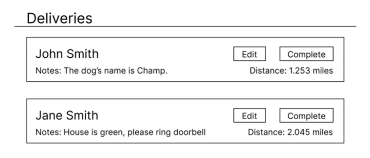

# NYC Planning – Open Source Engineering Team
## Code Challenge: Delivery manager

Welcome to the Application Engineering code interview!

To start this challenge, create a new **private** repo under your github username.We would like you to include all the code and documentation inside of the repo. You will have **48 hours** to complete this data challenge. Once you are done, please provide read access to your repo by inviting `@tangoyankee` (Timothy Miller) and `@TylerMatteo`.  
To share a private repository:
  - Select the `Settings` tab on the repository
  - Select the `Collaborators and teams` menu item
  - Choose `Add people` within the `Manage access` section

We will check your **commit history** to only account for the first **48 hours** of coding activities.

> ⚠️ Note: **the repo has to be `<em>`*private*`</em>`, otherwise you will be automatically `<em>`*disqualified*`</em>`**.

## What we are looking for

Your code interview will be evaluated based on your repo, so make sure all files you have are stored in your repo. Specifically we are looking at:

- **Project scaffolding**: How you name, manage, and organize your files.
- **Reproducibility**:
  - Ideally if it runs on your machine, it would also run on mine.
  - Make sure you document any software dependency and installation process.
- **Code**:
  - Clean
  - Readable
  - DRY (Don't Repeat Yourself)
- **Version control**:
  - Informative commit messages
  - Focused commits which preserve key moments in the development process
- **Documentation**:
  - A comprehensive `README.md` on anything that we should know about this repo.
  - Clear instructions on commands to run code and what to expect.
  - Clear documentation for functions/processes in code.
- **Robustness**:
  - Typing consistency *ex) strings treated consistently as strings*
  - Considerations for errors states- preventing and recovering from them
  - Meaningful tests
- **RESTfulness**:
  - API endpoints follow RESTful design
  - Response codes align with HTTP definitions 

## Introduction
You have been tasked with building a simple full stack service for delivery drivers to use while completing deliveries. You have been given a file of GeoJSON containing a FeatureCollection with 5 Point Features. Each Feature represents a delivery in New York City that the delivery driver must complete using your service.
Your service should contain two applications:
    1) a REST API for reading and updating deliveries
    2) a front-end web application that uses that API to show delivery drivers the data and allows them to update it.

The acceptance criteria below specify the expected features for the application. However, they are not exhaustive of all possible scenarios. Please add any additional code to make the applications more robust. If implementing your idea is not feasible within the allotted time, you may also document your thoughts with comments, readme notes, or some other method.

## Front End
The frontend can be considered the primary user interface for delivery drivers. It consists primarily of a map and a separate list of deliveries. The acceptance criteria below outline the specifically expected functionality. The exact layout and styling is at your discretion. With that in mind, please feel free to keep the visual design and layout of your front-end as simple as you would like. We encourage you to build toward “minimum viable product” for styling and then return to improving them and using your creativity if you have time. 

*This wireframe may serve as inspiration for displaying the list of deliveries. **Matching this wireframe is not required.***

From a technical perspective, it must run in a web browser. Correspondingly, it must either be directly written in HTML, CSS, and Javascript or written with tool that transpile to them. Please use any open source tools and/or frameworks that will improve the application or make it easier to develop.

### Acceptance Criteria
- [ ] There is a map of New York City
  - [ ] The deliveries are displayed as points on the map
    - [ ] Hovering on a delivery point opens a tooltip
    - [ ] The tooltip displays the recipient name and notes
  - [ ] Clicking on the map in an area without a delivery will place a point on the map
    - [ ] Clicking to a new location on the map moves the point to that new location
    - [ ] The coordinates of this point are used in later-described distance calculations
- [ ] A list of deliveries (separate from the map) is displayed with the following characteristics
  - [ ] 'Delivered' packages are excluded from the list
    - Only deliveries that still need to be delivered are shown
  - [ ] Each delivery item displays details about its recipient name and notes
    - [ ] If a user has chosen a point on the map (as described above), the distance from that point for each delivery is calculated and displayed.
  - [ ] If the user placed a point on the map (as described above), the deliveries are sorted based on distance to the point; the closest delivery is listed first
  - [ ] From this list, users can update the notes and delivered properties of each delivery
    - [ ] After a delivery is delivered, it is hidden from the list

## API
The API exists to manage and serve data for the frontend. It is initiated with data from the provided GeoJSON file. The 5 deliveries within the file consist of primarily two parts.
 - a geometry containing the destination coordinates for the delivery
 - a “properties” object containing data about that delivery including:
   - an ID
   - the recipient’s name
   - notes
   - a boolean “delivered” flag that indicates if a given delivery has been completed. 

These data are accessible to the frontend primarily through two endpoints described in the acceptance criteria described below. The API must communicate with the Frontend through HTTP requests. However, it may be implemented with the language of your choosing. Like the frontend, you are encouraged to use open source frameworks and tools.

### Acceptance criteria
- [ ] Contains two endpoints
    - [ ] The first endpoint returns the geojson for the deliveries
    - [ ] The second endpoint allows updates to "note" and/or "delivered" properties
    - [ ] This endpoint has an `id` parameter which specifies which delivery will be updated
    - [ ] This endpoint accepts a request body with data to update the "note", "delivered", or both values.
    - [ ] If the request body does not contain data to update a property, that property is left unchanged.
        - For example, providing data for only "notes" will update the "notes" but leave "delivered" unchanged.
    - While the initial data are provided in a file, the updates do not need to be preserved in the file. It's okay if the updates do not persist when stopping the application.
    - [ ] This endpoint returns a `404` response when no delivery is found for the provided `id`
     